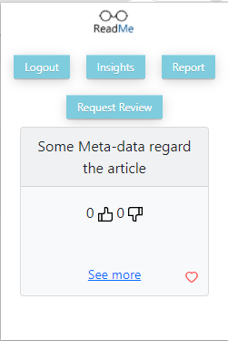
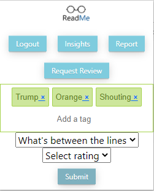
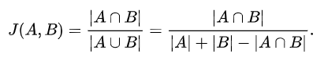

# ReadMe Project


## What is ReadMe
ReadMe is a crowd sourced web app that helps users explore the news. Our engine learns your preferences, and by using complex algorithms and the wisdom of the crowd it offers a custom made news feed for each user. Join us! Consume the news more efficiently and help other users as well!

## Links
* [Server](/internal/api)
* [Algorithms](/internal/alg)
* [Frontend](/dashboard)
* [Chrome Extension](/extension)
* [See docs](/data)
* [Database](/internal/db)

## Prerequisites
* Docker
* node > 10.6

## Run with Docker
```bash
$ ReadMe@Server:~/ReadMe/ docker-compose -f ./docker/docker-compose.yaml up --build -d 
$ ...
$ ...
Starting docker_mongodb_1 ... done
Starting docker_api_1        ... done
Starting docker_dashboard_1  ... done
Starting docker_mongo_seed_1 ... done
```

## API

[See docs](/docs/api.md)

## Chrome Extension
The chrome extension let you use our platform while you are browsing and reading news.  
* See Meta-data regard the current article you read.    
  <kbd>  
  
</kbd>   

* Earn ReadMe Credit by reporting on articles.  
    
  <kbd>
  
</kbd>

* Submit requests regard article easily.  
   
   <kbd>
  
</kbd>  

* How does it work?  
  background.js - as it's name runs all the time in the background.  
each new page we open on our browser triggers the operation of contentScript.js,  
which determines if the web page is an article or not and communicates with the background.  
if it is an article -  
the extension popup will have all details the as the background script communicated with the server and requested the data about it.  
Otherwise-  
new articles that we didn't see before on the server will be created- that's the way new articles created in our database.
  
  

[See docs](/docs/extension.md)


## Algorithms
### Recommendations
* Problem - Given user X Choose N articles to show.
* Solution: 
  * Based on Favorites DB Collection.
  * Model the Users, Articles, and Favorites to Bi Partite graph where User & Articles are nodes, favorites are edges. 
  * If we have enough Data - 
    * Aggregate Jaccard
     <kbd>
  
</kbd>
     ```python
        tuples = [(article_liked_by_user, some_article)
                  for article_liked_by_user in liked_articles_by_user
                  for some_article in articles
                  if not (article_liked_by_user == some_article some_article or in liked_articles_by_user)]

        similarity_scores = nx.jaccard_coefficient(G, tuples)
        article_set_ndup = [article for article in articles if article not in liked_articles_by_user]
        article_score_dict = dict.fromkeys(article_set_ndup, 0)
        for sim_score in similarity_scores:
            article_score_dict[sim_score[1]] += sim_score[2]
        sorted_dict = sorted(article_score_dict.items(), key=itemgetter(1), reverse=True)
        articles_sorted_by_score, scores = zip(*sorted_dict)
        recommended = articles_sorted_by_score[:RECOMMENDED_ARTICLES_TO_CALCULATE]
        if len(recommended) < RECOMMENDED_ARTICLES_TO_CALCULATE:
            recommended.extend(generic_recommendation(raw_graph, num_of_articles - len(recommended)))

    return {
        "error": None,
        "data": random.sample(recommended, num_of_articles)
    }
    ```
  * Else: (Not enough data to estimate user preferences)
     Generic recommendation using degree centrality measure.
      ```python
      if len(liked_articles_by_user) < NOT_ENOUGH_DATA_THRESHOLD:
        recommended = generic_recommendation(raw_graph, num_of_articles)
      ```
      ```python
      def generic_recommendation(raw_graph, num_of_articles):
        articles_by_degree = []
        for connected_component in nx.connected_components(raw_graph):
        connected_component = nx.subgraph(raw_graph, connected_component)
        users, articles = bipartite.sets(connected_component)
        articles_degree = filter(lambda node: node[0] in articles, connected_component.degree)
        articles_by_degree.extend(
            sorted(articles_degree, key=itemgetter(1), reverse=True))
    articles, _ = zip(*articles_by_degree)
    return articles[:num_of_articles]
      ```

### Request Routing
* Problem - Given user X offer the most relevant request.
* Relevant request - Request with the highest chance that the user will know the answer to.
* Solution - Tag based
  * Compute the user tags (User's "Strongest" fields of knowledge)
    * We simply Aggregate the favorites tags into the scores histogram and take the top X tags.
    * ```python
      def user_tags(user_id, num_of_tags):
      if user_id is None or num_of_tags is None:
        return {"labels": []}
      JSON_Graph = list(filter(valid_favorite_json, (mongo.db.favorites.find({"userid": user_id}))))
      if JSON_Graph is None:
          return {"labels": []}
      users_favorites_articles_ids = list(map(lambda like_edge: like_edge["articleid"], JSON_Graph))
      if len(users_favorites_articles_ids) == 0:
          return {"labels": []}
      articles = mongo.db.articles.find({'_id': {'$in': users_favorites_articles_ids}})
      labels = list(map(lambda article: article["labels"], articles))
      labels = functools.reduce(operator.iconcat, labels, [])
      by_label = defaultdict(Counter)
      for info in labels:
          counts = Counter({k: v for k, v in info.items() if k != 'label' and v > TAG_THRESHOLD})
          by_label[info['label']] += counts
      score_per_label = [(k, v.get("score")) for k, v in by_label.items()]
      score_per_label = sorted(score_per_label, key=itemgetter(1), reverse=True)
      labels = list(map(lambda label: label[0], score_per_label[:num_of_tags]))
      return {"labels": labels}
      ```
  * Choose requests regard articles with the largest intersection set between tag set and User's tag set
    * <kbd>
       
      </kbd>
    * ```python
      articles = list(mongo.db.articles.find({"_id": {"$in": [request["articleid"] for request in requests]}},
                                               {"labels": 1}))

        requests_labels = [(request["id"], article["labels"])
                           for request in requests
                           for article in articles
                           if request["articleid"] == article["_id"]]

        requests_labels = list(map(lambda x:
                                   (x[0],
                                    set([label["label"] for label
                                         in x[1] if label["score"] > TAG_THRESHOLD])),
                                   requests_labels))

        requests_for_user = [request[0] for request
                             in requests_labels
                             if len(request[1].intersection(users_tags)) > REQUEST_MATCH_THRESHOLD]
        if len(requests_for_user) < num_of_requests:
            requests_for_user.extend(generic_requests(num_of_requests - len(requests_for_user), requests))

        random.shuffle(requests_for_user)
        return {"requests": requests_for_user[:num_of_requests]}
        ```


# FIN :)
    
  

