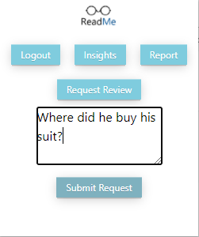

# ReadMe Project

## What is ReadMe
ReadMe is a crowd sourced web app that helps users explore the news. Our engine learns your preferences, and by using complex algorithms and the wisdom of the crowd it offers a custom made news feed for each user. Join us! Consume the news more efficiently and help other users as well!
## Prerequisites
* Docker
* node > 10.6
## Run with Docker
```bash
$ ReadMe@Server:~/ReadMe/ docker-compose -f ./docker/docker-compose.yaml up --build -d 
$ ...
$ ...
Starting docker_mongodb_1 ... done
Starting docker_api_1        ... done
Starting docker_dashboard_1  ... done
Starting docker_mongo_seed_1 ... done
```

## API

[See docs](/docs/api.md)

## Chrome Extension
The chrome extension let you use our platform while you are browsing and reading news.  
* See Meta-data regard the current article you read.    
  <kbd>  
  
</kbd>   
* Earn ReadMe Credit by reporting on articles.  
    
  <kbd>
  
</kbd>

* Submit requests regard article easily.  
   
   <kbd>
  
</kbd>  

[See docs](/docs/extension.md)


