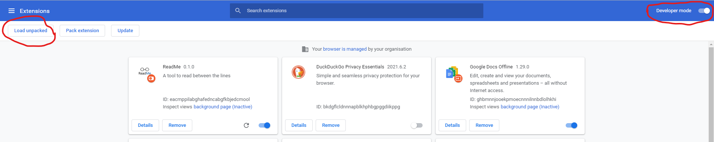

# ReadMe Chrome Extension

## How to run locally? 
1. Run the following commands in order to build the extension.
 ```
    cd extension/readme
    npm i
    npm run watch
```
2. Upload the manifest to chrome:  
   1. Go to [Extensions](chrome://extensions/) and check the box for Developer mode in the top right.
   2. Click on 'Load Unpack' at the top right corner.
   3. Now the extension is running - you can choose to pin it for better experience. 
   <kbd>
  
</kbd>  

## How to debug? 
* **Background script** - From [Extensions](chrome://extensions/) click on 'Inspect views' at ReadMe extension tile.
*  **Pop Up** - Click on the pop up, then right click on the extension and choose 'Inspect'
*  **Content Script** - This is running in every internet page you open. you can inspect any page and see contentScript.js is running.
